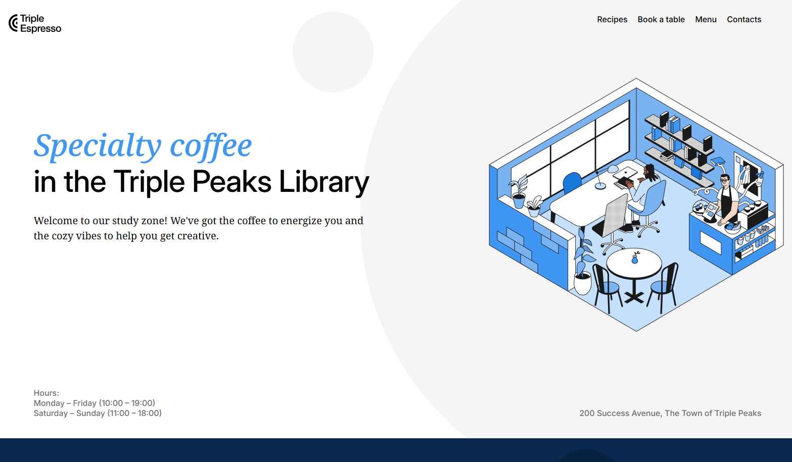

# Triple Peaks Coffee Shop Site

This project was created in addition to the Triple Ten Library's _new_ coffee shop. The site gives the customer insight into the shop's features, form to book a reservation, and shows information on the menu.

## Project features

- Semantic HTML5
- Flexbox
- Positioning
- Flat BEM file structure
- A custom form
- CSS animation and transform

## Plan on improving the project

In the future, I plan to add functionality to the form itself that would check for availabilty for the reservation date and time as well as send the customer an email on their reservation. One slight stlying element that I think would be nice to add is to have the menu slowly appear into the frame while scrolling down or maybe more animation as the user scrolls.
